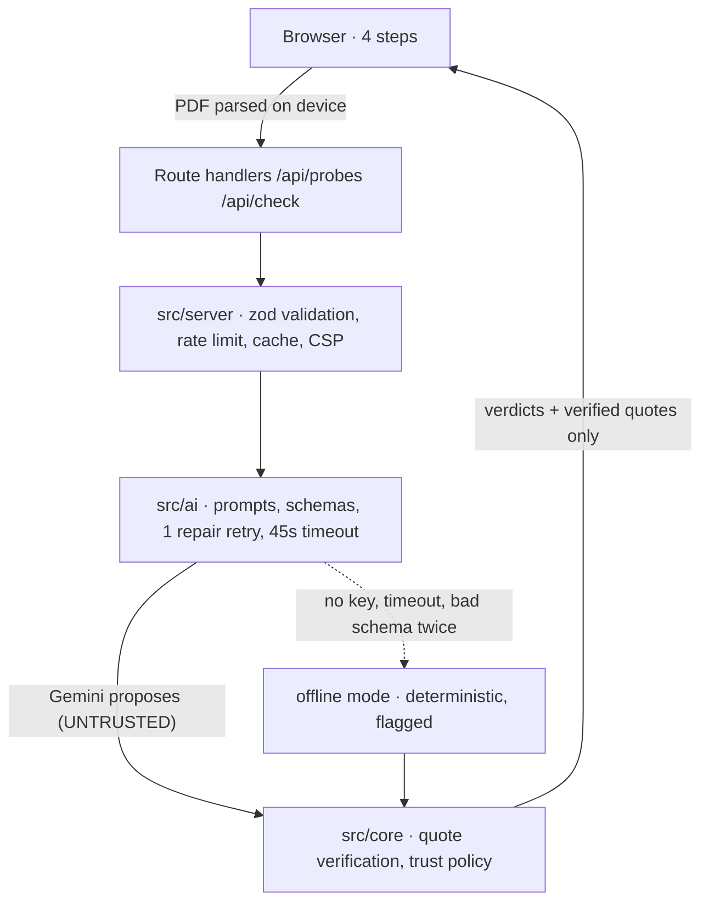

# Kasauti

**Test what you believe about a legal document — before you sign it.**

[](https://github.com/Shreekumar-Shah-AICTE/kasauti/actions/workflows/verify.yml)
[](https://github.com/Shreekumar-Shah-AICTE/kasauti/actions/workflows/codeql.yml)


**Live app: https://kasauti-pink.vercel.app** · Next.js 15 · TypeScript (strict) · Google Gemini

---

Most people do not misread contracts. They never read them, and sign on the strength of what they
believe and what they were told. Kasauti checks the belief, not the document: you say what you think
it says, and every answer comes back marked against your document's own words.

_Kasauti_ (कसौटी) is the touchstone — the stone used to test whether gold is real.

## Try it in 60 seconds

1. Open the app and click **Rent agreement** under _Try a sample_.
2. Keep the pre-selected situation and click **Next: your beliefs**. Gemini reads the document and
   writes the questions worth asking about **this** contract.
3. Answer in your own words, or click the chips under _Add a common belief_. Nothing is pre-filled:
   every belief checked is one you chose or typed.
4. Click **Check against the document** and read the report:
   - **You were right**, with the clause that backs it;
   - **The document says otherwise** — the deposit is not fully refundable;
   - **The document never says** — which becomes an _Ask for this in writing_ item.
5. Click **Show in document**. The document opens beside the verdict with the quote highlighted on
   its own page, at the offset code computed during verification.
6. Click **Copy report**. That plain-text list is what a user actually sends to a landlord, an
   employer, or a lawyer.

## What makes it different

**Teach-back before answers.** You commit to what you believe before the document is quoted back at
you. A tool that explains first can only confirm what you already assumed; this one can catch a
belief you did not know was wrong.

**The model proposes, code decides.** The model never has the last word:

| The model proposes                       | The user sees                                        |
| ---------------------------------------- | ---------------------------------------------------- |
| `backed`/`contradicted` + findable quote | that verdict, with a **code-computed** page + clause |
| `backed`/`contradicted` + no quote       | `needs_review` — _quote missing_                     |
| `backed`/`contradicted` + invented quote | `needs_review` — _quote unverified_                  |
| `silent` + ≥ 2 distinct search terms     | `silent` — "your document never says"                |
| `silent` + fewer terms                   | `needs_review` — _too few search terms_              |

Quoted text in the report is sliced out of **your** document by offset, so it cannot be a
paraphrase, and page and clause numbers are computed from where the quote was found — never taken
from the model. This is the project's central claim, so it is tested as an evaluation table of
plausible model replies, including dishonest ones, in `src/core/verdict/policy.eval.test.ts`.

**Silence is a finding.** "Your document never mentions this" is the answer most tools cannot give,
and it is exactly what turns a verbal promise into a risk you can act on.

**It degrades honestly.** With no key or an unreachable model the app still runs: standard questions
for your situation, deterministic keyword passages, every card marked for your own review, and a
banner saying so. It never silently pretends to have checked.

## Architecture



Nothing in `src/core` imports from `src/ai`. The core is pure, synchronous and fully tested; it is
the part a reviewer should read first. `ARCHITECTURE.md` has the layer map and the trust boundary in
detail.

### GenAI integration, exactly where

| Call       | Model                   | Integrated at                                  | Asked for                                              |
| ---------- | ----------------------- | ---------------------------------------------- | ------------------------------------------------------ |
| 1 (probes) | `gemini-3.5-flash-lite` | `src/ai/service.ts` → `POST /api/probes`       | Up to 3 questions worth asking about **this** document |
| 2 (check)  | `gemini-3.8-flash`      | `src/ai/service.ts` → `POST /api/check`        | One finding per belief: verdict, verbatim quote, terms |
| fallback   | `gemini-3.5-flash-lite` | same, on a provider error (never on a timeout) | Downgrading beats dropping to offline mode             |

**Exactly two model calls per document**, whatever its size or belief count. Every reply is a zod
schema used both as the Gemini JSON-schema contract and as the validator; an invalid reply gets one
repair attempt that echoes the validation error back, then falls back. Document and belief text is
fenced and tag-defanged before it reaches a prompt, because a contract is untrusted input that can
ask the model to lie. See `docs/GENAI_ARCHITECTURE.md`.

## Evidence, not claims

| Claim                                  | Where it is proved                                                                    |
| -------------------------------------- | ------------------------------------------------------------------------------------- |
| Code overrules the model               | `src/core/verdict/policy.eval.test.ts`, an eval table of honest and dishonest replies |
| It is right about real documents       | 33/33 hand-labelled beliefs, 0 unverifiable quotes — `LIVE_VALIDATION.md`             |
| The whole flow works                   | `src/components/flow.test.tsx` drives sample → beliefs → report with a stubbed API    |
| Usable by keyboard and screen reader   | `src/components/a11y.test.tsx` runs axe-core over the app and the report              |
| No known vulnerable dependency         | CI fails on any high-severity advisory (`npm audit --omit=dev`)                       |
| Reproducible, tamper-resistant builds  | Committed lockfile + `npm ci`; every GitHub Action pinned to a commit SHA             |
| No insecure code pattern               | CodeQL analysis on every push and weekly                                              |
| Dependencies stay current              | Grouped weekly Dependabot updates, each gated by the same verify run                  |
| Decisions were reasoned, not defaulted | Six ADRs in `docs/adr/`, including the ones that cost us something                    |

### Security, in one table

| Threat                                 | Mitigation                                                    | Where                           |
| -------------------------------------- | ------------------------------------------------------------- | ------------------------------- |
| A contract that tells the model to lie | Fenced, tag-defanged document text; schema-locked output      | `src/ai/prompts.ts`             |
| An invented quote                      | Code re-finds every quote; unverifiable → _needs review_      | `src/core/verdict/policy.ts`    |
| Another site spending our model quota  | `Sec-Fetch-Site`/`Origin` check (403), JSON-only bodies (415) | `src/server/requestGuards.ts`   |
| Floods and loops                       | Per-client token bucket on a hashed IP (429)                  | `src/server/rateLimit.ts`       |
| Oversized or malformed input           | Byte cap before parsing (413), strict zod schemas (422)       | `src/server/validateInput.ts`   |
| XSS, clickjacking, sniffing            | Nonce CSP with `strict-dynamic`, `frame-ancestors 'none'`, …  | `src/server/securityHeaders.ts` |
| Leaked key or stack trace              | Server-only key; fixed client-safe error messages             | `src/server/errors.ts`          |
| Stored personal documents              | Nothing stored or logged; cache keys are SHA-256 hashes       | `src/server/cache.ts`           |

### Efficiency, by design

- **Two model calls per document, never one per belief.** Probes read only the first 12,000
  characters; every belief is checked in one batched call (ADR 0005).
- **Repeat work is free.** Live results are cached by a SHA-256 of the validated input (LRU, 100
  entries, 30-minute TTL), and identical requests already in flight share one model call.
- **Cheap before expensive.** Size, origin, content-type and rate-limit checks run before the body
  is parsed; quote verification tries exact, then normalised matching, and only then an O(n)
  rolling word-overlap filter that gates the O(m²) edit-distance check.
- **Nothing blocks forever.** Each model call has a 45 s abort; the browser abandons a request
  after 90 s with a clear message.
- **Send only what the model reads.** The browser uploads just the first 12,000 characters for
  probes; a document longer than 32,000 characters is cut to the clauses that share keywords with
  the beliefs before the check call, and quotes are still verified against the full text (ADR 0007).
- **Bounded output.** Every call caps `maxOutputTokens`, so a runaway reply cannot hold the function
  open.
- **No repeat round trips.** Re-checking unchanged beliefs is answered from an in-tab memo of live
  results; PDF pages are extracted concurrently; the report is memoised so re-renders reuse it.
- **Small client.** pdf.js is loaded with a dynamic `import()` only when a PDF is chosen, and runs
  in a worker. Six runtime dependencies in total.

### Measured against the deployed app, not a mock

```bash
node evals/run.mjs https://kasauti-pink.vercel.app
```

33 hand-labelled beliefs over three documents (rent agreement, offer letter, freelance contract),
phrased the way a person would say them rather than the way the clause is written:
**33/33 correct · 0 unverifiable quotes · 0 abstentions** (backed 10/10, contradicted 14/14,
silent 9/9). The first run scored 32/33; the miss and the prompt rule that fixed it are written up
in `LIVE_VALIDATION.md`, because how the number improved is the evidence, not the number.

## Running it

```bash
npm install
GEMINI_API_KEY=your-key npm run dev   # http://localhost:3000
```

Without a key the app still works, in offline mode.

```bash
npm run verify   # typecheck → lint (0 warnings) → format → tests (100% coverage) → build
```

`npm run verify` is the only gate that matters: it is what CI runs on every push and pull request,
and nothing is committed red. Lint enforces structure as well as style — complexity ≤ 8, ≤ 250 lines
per file, ≤ 40 per function, ≤ 3 parameters, nesting ≤ 3, no `any`, no `as`, no non-null assertions,
no `eslint-disable`, and no magic numbers outside `src/core/constants.ts`.

| Gate                 | Setting                                                                     |
| -------------------- | --------------------------------------------------------------------------- |
| Types                | TypeScript strict, `noUncheckedIndexedAccess`; no suppressions anywhere     |
| Tests                | 198 tests; coverage thresholds 100% statements/branches/functions/lines     |
| Accessibility        | axe-core in CI; icon + word + colour on every verdict; `aria-live` regions  |
| Security             | strict nonce-based CSP (no inline styles), rate limiting, CodeQL, npm audit |
| Duplication / cycles | `jscpd` clean, `madge --circular` clean                                     |

## Interface

Built for someone who is anxious and short of time: a numbered stepper, one decision per step, and a
progress panel that names the model call being made instead of showing a bare spinner. The report
leads with what the document contradicts, not with what it confirms, and each verdict can be opened
beside the document with its quote highlighted in place.

Every verdict carries an icon, a word and a colour, so it never depends on colour alone. Status and
progress live in `aria-live` regions, the highlight takes focus when it is requested, and the whole
flow — including the report and its document panel — is checked with axe-core. There are no inline
styles anywhere: the app runs under a strict, nonce-based CSP.

## Privacy

PDFs are parsed in your browser; only the extracted text is sent, and only when you ask for a check.
Nothing is written to a database — there is no database. Live results are held in an in-memory cache
keyed by a hash of the input, for the lifetime of the server instance. The API key is server-side
only. See `SECURITY.md`.

## Repository map

```
src/core/      pure decision layer: text mapping, quote verification, verdict policy  (no AI here)
src/ai/        prompts, zod schemas, repair retry, offline fallbacks
src/server/    validation, rate limit, cache, security headers
src/app/       Next.js app router and the two route handlers
src/components/four steps, verdict cards, document panel — presentation only
src/lib/       flow reducer, report model, document view, in-browser PDF extraction
evals/         33 labelled beliefs and the runner used against the live deployment
docs/          GenAI architecture, demo script, ADRs
```

| Document                     | What it covers                                            |
| ---------------------------- | --------------------------------------------------------- |
| `ARCHITECTURE.md`            | The layers, and why the trust boundary sits where it does |
| `docs/GENAI_ARCHITECTURE.md` | Each GenAI service and exactly where it is integrated     |
| `SECURITY.md`                | Input limits, rate limiting, CSP, what is not stored      |
| `RISKS.md`                   | Honest failure modes, including ones not yet fixed        |
| `LIVE_VALIDATION.md`         | Measured accuracy of the deployed app, and where it fails |
| `docs/DEMO_SCRIPT.md`        | The recorded walkthrough, shot by shot                    |
| `docs/adr/`                  | Decisions that were expensive to make                     |
| `CONTRIBUTING.md`            | The one workflow rule: never commit red                   |

## Limits

Kasauti gives information, not legal advice. It reads what your document says; it cannot tell you
whether a clause is enforceable where you live. Scanned PDFs have no selectable text, so they must be
pasted in. Long documents are capped, and the cap is stated in the UI when it is hit. The evaluation
covers three document types; consumer contracts are not yet measured. Every known weakness is listed
in `RISKS.md` rather than left for a reviewer to find.

## Licence

MIT — see `LICENSE`.
